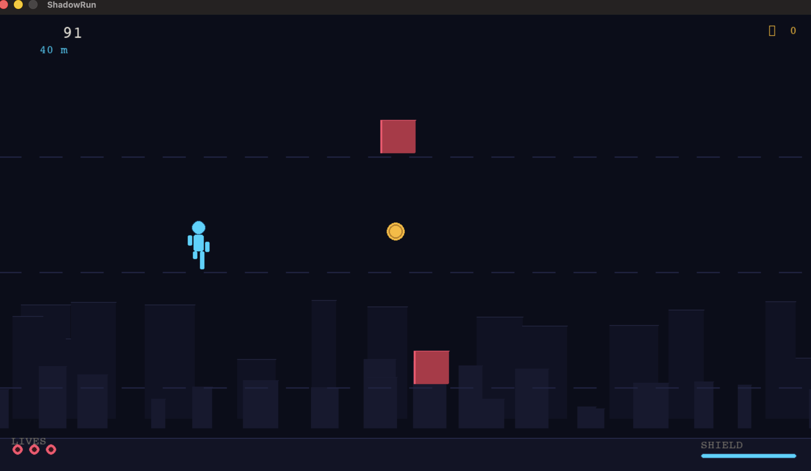
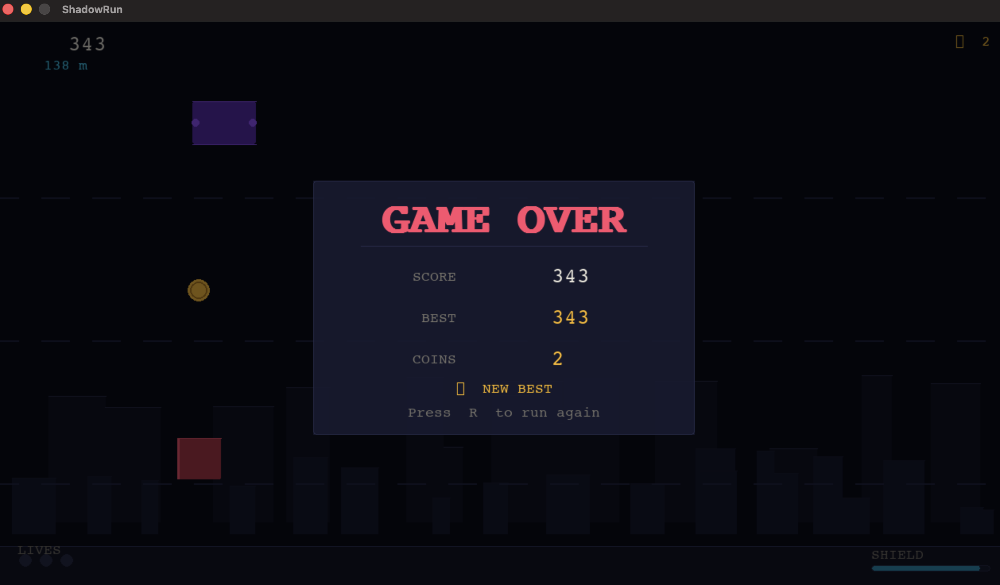

# ShadowRun

ShadowRun is a single-player 2D side-scrolling endless runner controlled by body gestures from a live webcam feed. Dodge obstacles, collect coins, and activate shields using physical movements or a standard keyboard fallback.

The project uses two windows driven by a single-threaded loop (to comply with macOS main-thread rendering requirements):
1. **ShadowRun — Camera**: A live camera overlay showing the upper-body skeleton track.
2. **ShadowRun**: The Pygame game canvas showing the runner, obstacles, and gameplay HUD.

---

## Screenshots

<p align="center">
  
</p>

<p align="center">
  
</p>

---

## Installation

### 1. Requirements
- Python 3.10+
- Webcam / Camera hardware
- macOS: Camera permissions must be granted to the terminal or IDE launching the application.

### 2. Set Up Virtual Environment
```bash
# Create virtual environment
python -m venv .venv

# Activate virtual environment
source .venv/bin/activate  # On Windows: .venv\Scripts\activate
```

### 3. Install Dependencies
```bash
pip install -r requirements.txt
```

---

## How to Run

Activate your virtual environment and run the entry script:
```bash
python main.py
```

---

## Control Reference

| Action | Webcam Gesture | Keyboard Fallback |
| :--- | :--- | :--- |
| **Move Left** | Lean shoulders left | Left Arrow / **A** |
| **Move Right** | Lean shoulders right | Right Arrow / **D** |
| **Jump** | Raise either hand above shoulder level | Up Arrow / **W** |
| **Slide** | Drop both hands below hip level quickly | Down Arrow / **S** |
| **Shield** | Cross wrists in front of your chest | Space |
| **Quit** | Press **Q** / Escape in either window or close it | Escape |

---
# Shadow_Run_Gesture_Control
